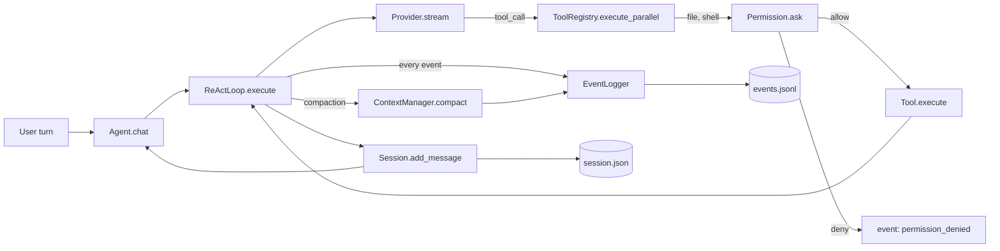

# Codesm Architecture

A terminal coding agent built to study how coding models fail. This doc
is the map a new contributor needs to navigate the repo
in under two minutes. Each section links to the exact file and class
that owns the concern.

## End to end flow

The agent turn is: user message in, stream from provider, tool calls
out, tool results back, possibly compact, repeat until the model stops
emitting tool calls or hits the iteration cap.

## Layers

**Agent shell.** `codesm/agent/agent.py:20` (`Agent`) owns one
`Session`, one `Provider`, one `ToolRegistry`, one `ContextManager`,
one `EventLogger`, and one `ReActLoop`. `Agent.chat()` adds the user
message, builds the system prompt with skills and rules, and delegates
the turn to the loop. All session and MCP state lives on the agent.

**ReAct loop.** `codesm/agent/loop.py:17` (`ReActLoop`) is the core
state machine: stream from provider, collect tool calls, execute them
in parallel (capped at 64 per turn), append results, loop. It owns
compaction, failure mode emission, and the max iteration guard.
Every structured signal (iteration start, compaction, tool error,
permission denial, malformed tool call, max iterations) is emitted
through the `_emit` closure that writes to both the `EventLogger`
and the eval runner's in memory sink.

**Provider routing.** `codesm/provider/base.py:25` (`Provider`) is
the abstract streaming interface. Four concrete backends sit behind
it: `anthropic.py`, `openai.py`, `openrouter.py`, `ollama.py`.
`codesm/provider/router.py` picks one based on the model id prefix
(`anthropic/claude-...`, `openai/gpt-...`, `openrouter/...`,
`ollama/...`). The loop is provider agnostic; only stream chunk
shapes and tool call encoding differ per backend.

**Tool registry.** `codesm/tool/registry.py:15` (`ToolRegistry`) is
a single dispatch table that holds built in tools, MCP tools, and
code execution tools side by side. `get_schemas()` returns JSON schema
to the provider, `execute_parallel()` runs a batch of calls through
`asyncio.gather`. Each built in tool lives in `codesm/tool/<name>.py`
with a matching `.txt` prompt description.

**MCP integration.** `codesm/mcp/manager.py:15` (`MCPManager`) owns
one or more MCP server subprocesses discovered via `mcp-servers.json`.
`client.py` speaks the Model Context Protocol, `codegen.py` turns
tool schemas into invokable Python, `sandbox.py` runs the generated
code in a subprocess. The manager is plugged into `ToolRegistry` on
first `chat()` so MCP tools appear alongside built ins.

**Session and context.** `codesm/session/session.py:20` (`Session`)
is the persistent record of a run: messages, tool display blocks,
title, topics. Stored under `~/.local/share/codesm/sessions/`.
`codesm/session/context.py:88` (`ContextManager`) owns compaction:
`TokenEstimator` counts tokens with tiktoken, the manager trips at
`max_tokens * compact_trigger_ratio` (default 128K times 0.75), and
a three phase compaction prunes old tool outputs, selects recent
messages within a 40 percent budget, and summarizes the middle via an
async LLM callback. System messages and the `_context_summary`
marker are always preserved at the top.

**Permission and audit.** `codesm/permission/permission.py:105`
(`Permission`) gates `bash`, `write`, and `edit` through a three
response type flow (`ALLOW_ONCE`, `ALLOW_ALWAYS`, `DENY`). Hard
blocks on patterns like `rm -rf /` and `~/.ssh/*` sit above the
interactive path and cannot be overridden. Denials raise
`PermissionDeniedError` which the tool layer encodes as a
`"Permission denied: ..."` prefixed string. Every request and
response is written to `~/.local/share/codesm/audit.jsonl` by
`codesm/audit/audit.py:48` (`AuditLog`).

**Failure mode events.** `codesm/agent/event_log.py:24` (`EventLogger`)
is append only JSONL at
`~/.local/share/codesm/events/<session_id>.jsonl`. The ReAct loop
emits six event types: `iteration_start`, `compaction`, `tool_error`,
`permission_denied`, `malformed_tool_call`, `max_iterations`. The
`eval` subcommand drains the same events through an in memory sink
into `EvalReport` so benchmark runs get per failure mode counters
for free.

**TUI.** `codesm/tui/app.py` is the Textual entry point.
`chat.py` renders streaming text and a collapsible tool call tree
from `tools.py`. `StreamingTextWidget` in `tools.py` handles the
text and tool call ordering fix from commit `f024ac2`: each
contiguous text run is a sealed widget, so a tool call can never
reorder around a live streaming text block. The modal permission
prompt is in `permission_modal.py`, driven by the `Permission.ask`
callback.

## Data flow invariants

1. One `Agent` owns exactly one active `Session` at a time. Switching
   sessions via `new_session()` resets the skill cache and re
   instantiates the `EventLogger`.
2. The ReAct loop never mutates the caller's message list. It copies
   once at entry and appends locally so the `Session.add_message`
   writes are the only durable record.
3. Tool results are strings with a prefix contract: `"Permission
   denied: ..."` for permission errors, `"Error: ..."` for path or
   command blocks, `"Error executing <tool>: ..."` for execution
   failures. The loop's failure mode classifier depends on this.
4. Compaction preserves tool call to tool result id linkage.
   Pruning replaces content with `[OUTPUT PRUNED: N chars]` but
   keeps the `tool_call_id` and role intact so the provider never
   sees an orphaned tool call.
5. Every loop iteration emits an `iteration_start` event before it
   does any work. If a session's JSONL file has N `iteration_start`
   events, the loop ran N turns.

## File index for interviewers

| Concern                     | File and class                                   |
|-----------------------------|--------------------------------------------------|
| Agent shell                 | `codesm/agent/agent.py:20` `Agent`               |
| ReAct loop                  | `codesm/agent/loop.py:17` `ReActLoop`            |
| Failure mode events         | `codesm/agent/event_log.py:24` `EventLogger`     |
| Provider interface          | `codesm/provider/base.py:25` `Provider`          |
| Tool registry               | `codesm/tool/registry.py:15` `ToolRegistry`      |
| MCP manager                 | `codesm/mcp/manager.py:15` `MCPManager`          |
| Session                     | `codesm/session/session.py:20` `Session`         |
| Context compaction          | `codesm/session/context.py:88` `ContextManager`  |
| Permission gate             | `codesm/permission/permission.py:105` `Permission` |
| Audit log                   | `codesm/audit/audit.py:48` `AuditLog`            |
| Eval report                 | `codesm/eval/metrics.py` `EvalReport`            |
| Eval runner                 | `codesm/eval/runner.py` `run_task`               |
| TUI app                     | `codesm/tui/app.py`                              |

For the longer version of why each of these decisions was made, see
`DESIGN_NOTES.md`. For the catalog of failure modes this architecture
exists to surface, see `FAILURE_MODES.md`.
