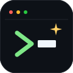
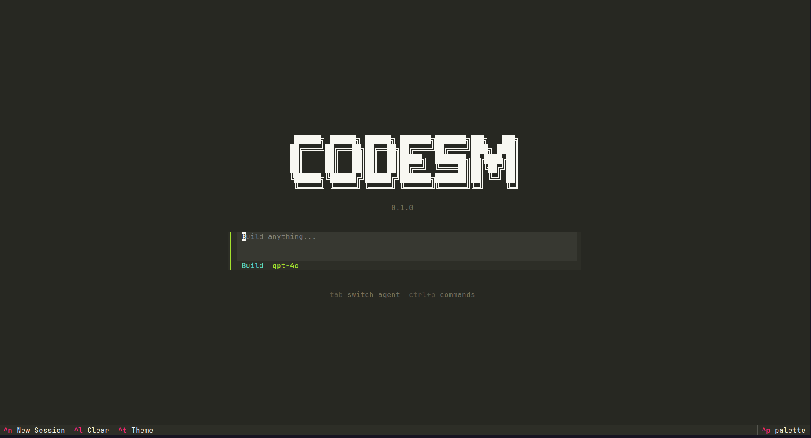
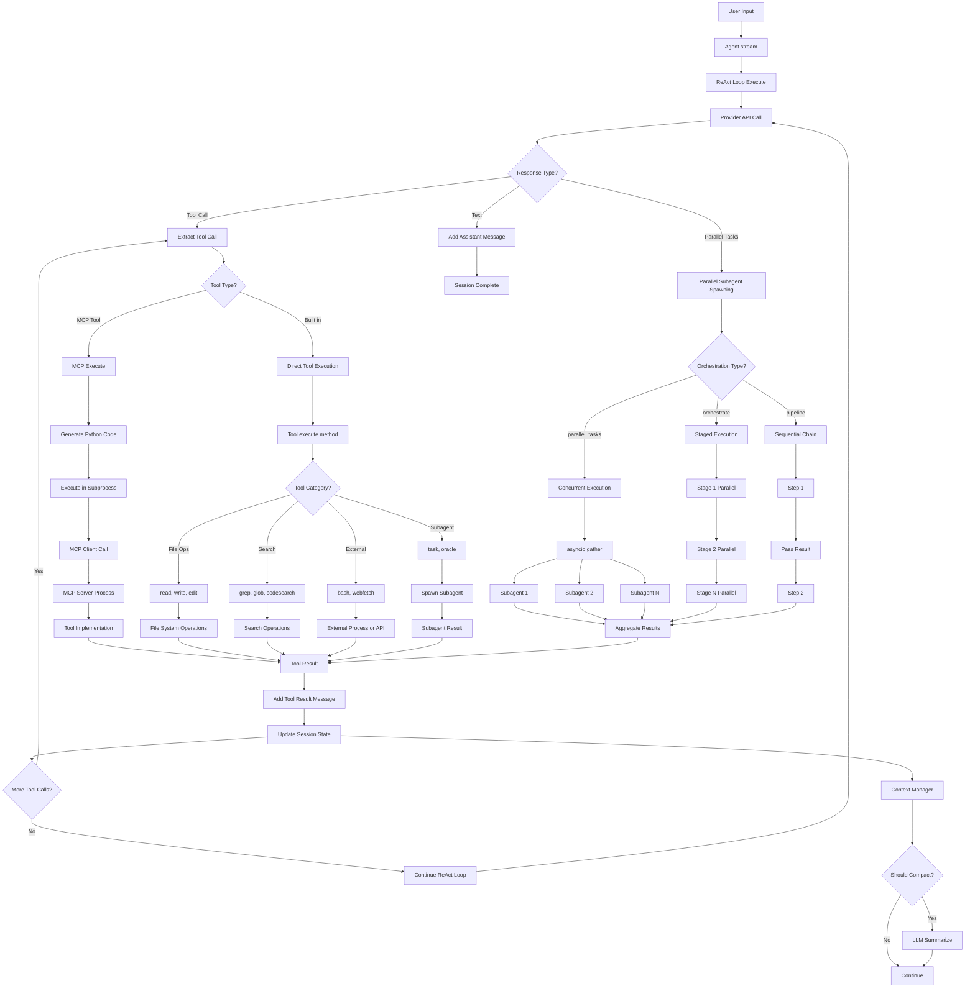

<!-- <CENTERED SECTION FOR GITHUB DISPLAY> -->

<div align="center">



<h1>Codesm</h1>

**An AI coding agent for the terminal. Built to study how coding models fail.**

</div>

> [!TIP]
>
> Talks to Anthropic, OpenAI, OpenRouter, and local Ollama. Ships with 30 built in tools, speaks Model Context Protocol, runs parallel and pipelined subagents, integrates with Language Server Protocol for real code intelligence, compacts its own context, and logs every permission decision to an audit trail. <br />
> Built to answer one question: *where exactly do coding models break down when you try to use them as real engineers?*
>
> | [](https://github.com/Aditya-PS-05) | Follow [@Aditya-PS-05](https://github.com/Aditya-PS-05) on GitHub for more projects. Hacking on AI coding agents, agent infrastructure, and model evaluation tooling. |
> | :-----| :----- |

<div align="center">

[](https://www.python.org/)
[](https://textual.textualize.io/)
[](https://www.anthropic.com/)
[](https://openai.com/)
[](https://ollama.com/)
[](https://modelcontextprotocol.io/)
[](https://github.com/Aditya-PS-05/codesm/graphs/contributors)
[](https://github.com/Aditya-PS-05/codesm/network/members)
[](https://github.com/Aditya-PS-05/codesm/stargazers)
[](https://github.com/Aditya-PS-05/codesm/issues)
[](./LICENSE)

</div>

<!-- </CENTERED SECTION FOR GITHUB DISPLAY> -->

> **Run `uv pip install -e .` and launch `codesm`. You get a fully instrumented coding agent that logs every failure mode, not just the successes.**



> Codesm is deliberately verbose about what it is doing. Every tool call, permission prompt, compaction event, and subagent spawn shows up in the TUI tree, because you cannot build an eval for a failure mode you cannot see.

## Overview

**Codesm** is a terminal first AI coding agent written in Python. It speaks to multiple providers (Anthropic Claude, OpenAI, OpenRouter routed models, and local Ollama), exposes a wide tool surface, and runs a ReAct loop that can fan out into parallel subagents or chain them into pipelines.

It is not trying to be the fastest or the most polished coding agent in the world. Tools like Claude Code, Cursor, Windsurf, Amp, and Aider already exist and are excellent. Codesm exists for a different reason.

**Most coding agent failures happen in places you cannot see.** Context windows silently overflow. Tool calls arrive out of order. Permission systems get bypassed. Subagents hallucinate tool names that do not exist in the registry. Providers disagree about edge case tool schemas. When you only use a closed source agent, you learn what works. You do not learn what *does not.*

I built Codesm to make every one of those failure modes visible, loggable, and reproducible. Every tool call is auditable. Every compaction is logged with token counts. Every permission denial becomes a structured event. Every subagent spawn is tree rendered in the TUI. The goal is not to hide the complexity of agent execution. The goal is to surface it.

This makes Codesm useful in three ways: as a real coding agent for day to day work, as a testbed for trying new orchestration patterns, and as a rig for studying how different models fail at the same task.

### Why "Codesm"?

The name is **code** plus the same "ism" suffix you see in *aphorism*, *mechanism*, *organism*. It implies a system, a set of habits, a way of doing a thing. Codesm is the code writing system I built to figure out *my own* habits around working with coding models, and where those habits diverge from what the models actually do.

(It also reads nicely as "code ism": a philosophy, not a tool. That is on purpose.)

## Contents

- [Overview](#overview)
  - [Why "Codesm"?](#why-codesm)
- [Features](#features)
- [Failure Modes Observed](#failure-modes-observed)
- [Installation](#installation)
  - [Quick Start](#quick-start)
  - [Prerequisites](#prerequisites)
  - [From Source](#from-source)
- [Usage](#usage)
  - [Basic Commands](#basic-commands)
  - [Providers](#providers)
  - [Tool System](#tool-system)
  - [Parallel Subagents](#parallel-subagents)
  - [Pipeline Subagents](#pipeline-subagents)
  - [Context Management](#context-management)
  - [Permissions and Audit](#permissions-and-audit)
  - [Sessions](#sessions)
- [Configuration](#configuration)
  - [Environment Variables](#environment-variables)
- [MCP Integration](#mcp-integration)
- [How It Works](#how-it-works)
- [Architecture](#architecture)
- [Development](#development)
  - [Prerequisites](#prerequisites-1)
  - [How to Run](#how-to-run)
- [Supported Platforms](#supported-platforms)
- [CLI Reference](#cli-reference)
- [Contributing](#contributing)
- [Acknowledgments](#acknowledgments)
- [License](#license)

## Features

- **Many providers.** Anthropic Claude, OpenAI, OpenRouter routed models, and local Ollama. Same ReAct loop, four backends. Route different subagents to different models based on task (Sonnet for coding, Flash for search, o1 for deep reasoning).
- **ReAct loop.** Canonical reason then act agent loop with streaming, automatic iteration limits, and per iteration context budget checks. Implemented in [`codesm/agent/loop.py`](./codesm/agent/loop.py).
- **Thirty built in tools.** `bash`, `read`, `write`, `edit`, `multiedit`, `patch`, `grep`, `glob`, `ls`, `codesearch` (embedding based), `lsp` (symbols, diagnostics, references), `git`, `websearch`, `webfetch`, `oracle` (deep reasoning), `refactor`, `testgen`, `bug_localize`, `code_review`, `mermaid`, and more. All registered through a central [`tool/registry.py`](./codesm/tool/registry.py).
- **MCP server integration.** Speaks Model Context Protocol natively. Load external tools from any MCP server (`mcp-servers.json`), or expose Codesm's own tools over MCP to other agents. Full client, codegen, and sandbox implementation in [`codesm/mcp/`](./codesm/mcp/).
- **Parallel subagents.** `parallel_tasks` tool runs up to ten subagents concurrently via `asyncio.gather`, with auto routing, fail fast, and per task timing. Built for embarrassingly parallel work (find all API endpoints AND analyze auth flow AND locate tests).
- **Pipeline subagents.** `pipeline` tool chains subagents sequentially, passing each step's output to the next. Up to five stages. Built for compositional tasks where later stages depend on earlier ones.
- **Staged orchestration.** `orchestrate` tool: sequential stages, parallel tasks within each stage. The natural shape for "research then plan then implement then test" workflows.
- **Context compaction.** [`ContextManager`](./codesm/session/context.py) estimates tokens, triggers compaction at a configurable ratio of the max, and summarizes older messages via an LLM while preserving recent turns. Wired directly into the ReAct loop so compaction happens mid conversation, not just at session boundaries.
- **LSP backed code intelligence.** Real Language Server Protocol integration ([`codesm/lsp/`](./codesm/lsp/)) for symbol lookup, diagnostics, hover, and references. Gives the agent ground truth about types and symbols instead of making it guess from context.
- **Embedding code search.** `codesearch` tool uses sentence transformers for semantic code retrieval, not just string match. Handy when the agent has no idea what file to read next.
- **Permission system.** Structured permission requests for file writes, edits, and shell commands via [`codesm/permission/`](./codesm/permission/). Every grant and deny goes to an append only audit log.
- **Audit log.** [`codesm/audit/`](./codesm/audit/) records file operations, bash executions, permission decisions, and tool call traces. Designed so you can replay a session and reconstruct exactly what the agent did.
- **Session management.** Each run is a session: title, topics, summary, message history, event stream. Sessions persist, so you can resume a conversation or inspect a past run.
- **Textual TUI.** Collapsible tool call tree, streaming text, thinking display, oracle and subagent widgets, inline diffs for file edits, command palette, slash commands. Built on [Textual](https://textual.textualize.io/).
- **Skills system.** Skill suggestions aware of file context. The agent gets different prompts depending on whether it is editing Python, Rust, TypeScript, or SQL. Implemented in [`codesm/skills/`](./codesm/skills/).
- **Multiple memory layers.** Session memory, project memory (CLAUDE.md and AGENTS.md style files), and topic indexed rolling summaries.

## Failure Modes Observed

> **Why this section exists:** Codesm is instrumented to surface failure modes that most agents hide. These are real things I hit while building and using it. Each one has the shape of a future benchmark or eval.

1. **Silent context overflow.** ReAct loops blow up context fast. Every tool call appends a `tool_use` and a `tool_result` block. By iteration twenty of a real coding task, you are often past the model's useful attention window even if you are still under its hard limit. Codesm's [`ContextManager`](./codesm/session/context.py) monitors token estimates and triggers an LLM based compaction before the loop stalls. The summarizer is provider agnostic. See [`session/summarize.py`](./codesm/session/summarize.py) for the three paths (`_summarize_with_anthropic`, `_summarize_with_openai`, `_summarize_with_openrouter`).

2. **Out of order tool call streaming.** Different providers interleave `text` and `tool_use` blocks differently when streaming. Claude emits text and tool_use in the order they were generated; OpenAI's Chat Completions stream has a different timing. A naive TUI that renders chunks as they arrive will show tool calls above the reasoning that justifies them. Fixed in commit [`f024ac2`](https://github.com/Aditya-PS-05/codesm) (`fix(tui): display text and tool calls in sequential order`) by buffering chunks until a message block is complete, then rendering in emission order.

3. **Tool name hallucination.** Models occasionally emit a `tool_use` block with a tool name that does not exist in the registry, often a near miss like `read_file` instead of `read`, or a tool from a previous conversation that no longer exists. Codesm's registry returns a recoverable error (`"Unknown tool: <name>. Available: ..."`) instead of crashing, so the model can self correct on the next turn. This turns a hard failure into a measurable self correction signal.

4. **Permission bypass via composition.** Giving an agent `bash` is effectively giving it everything. It can `rm`, `curl`, run `python -c`, or dump secrets with `cat ~/.ssh/id_rsa`. Codesm's permission system wraps `bash`, `write`, and `edit` through a [`Permission`](./codesm/permission/permission.py) gate with configurable allow lists and an audit trail. The interesting failure mode is *composition*: a model denied `rm` will sometimes try to accomplish the same thing via `bash -c "python -c \"import os; os.remove(...)\""`. Logging denials with the full command string makes these attempts visible and evaluable.

5. **Orchestration mode mismatch.** Given a multi step task, models default to sequential execution even when subtasks are independent. Asking the same model the same question with `parallel_tasks` vs a plain prompt produces dramatically different wall clock times and token usage. This is an evaluation axis in its own right: how well does the model choose between `parallel_tasks`, `pipeline`, and plain sequential tool calls? Codesm exposes all three primitives so you can measure it.

6. **Subagent result reintegration.** When a parallel subagent returns a long result, the parent agent's next turn sometimes ignores it or summarizes it incorrectly. This is a context attention failure, not a capability failure. Codesm logs each subagent's full output to the event stream so you can diff what was produced against what was used.

Each of these is a real, reproducible phenomenon, not a theoretical concern. They are the raw material for the kind of eval suites coding model teams build.

## Installation

### Quick Start

```bash
# Clone and install with uv (recommended)
git clone https://github.com/Aditya-PS-05/codesm
cd codesm
uv pip install -e .

# Launch the TUI
codesm

# Or run directly with uv
uv run codesm
```

That is it. Set `ANTHROPIC_API_KEY` (or `OPENAI_API_KEY`, or point at a local Ollama) and start typing.

> **PyPI release:** A proper PyPI package (`pip install codesm`) is on the roadmap. For now, install from source. It is a single `uv pip install -e .` away.

### Prerequisites

- [**Python**](https://www.python.org/downloads/) 3.12 or newer
- [**uv**](https://docs.astral.sh/uv/) (recommended) or `pip` for dependency management
- **At least one LLM provider** configured:
  - **Anthropic** (default): `ANTHROPIC_API_KEY`, [docs](https://docs.anthropic.com/en/api/getting-started)
  - **OpenAI**: `OPENAI_API_KEY`, [docs](https://platform.openai.com/docs/quickstart)
  - **OpenRouter**: `OPENROUTER_API_KEY`, [docs](https://openrouter.ai/docs)
  - **Ollama** (local): install [Ollama](https://ollama.com/), pull a model (`ollama pull llama3.1`), then point Codesm at it
- **Optional LSP servers** for richer code intelligence: `pylsp` or `pyright` (Python), `rust-analyzer` (Rust), `typescript-language-server` (TS and JS)

### From Source

```bash
# Clone and install in editable mode
git clone https://github.com/Aditya-PS-05/codesm
cd codesm
uv venv
source .venv/bin/activate
uv pip install -e ".[dev]"

# Run tests
pytest tests/ -v

# Launch
codesm
```

## Usage

### Basic Commands

```bash
# Launch the interactive TUI (default)
codesm

# Point at a specific provider and model
codesm --provider anthropic --model claude-sonnet-4-5
codesm --provider openai --model gpt-4o
codesm --provider ollama --model llama3.1

# Resume a previous session
codesm --resume <SESSION_ID>

# Run a one shot task without the TUI (scriptable)
codesm run "Add a docstring to the hello() function in /tmp/test.py"
```

Inside the TUI, slash commands control the session:

```
/help           Show all slash commands
/provider       Switch LLM provider mid session
/model          Switch model
/compact        Manually trigger context compaction
/tools          List available tools
/sessions       Browse past sessions
/clear          Clear the current conversation
/quit           Exit
```

### Providers

Codesm supports four provider backends, each routed through a common interface in [`codesm/provider/`](./codesm/provider/). Different subagents can use different providers. A search subagent might use fast and cheap Gemini Flash while a reasoning subagent uses o1.

```bash
# Anthropic Claude (default)
export ANTHROPIC_API_KEY="sk-ant-..."
codesm --provider anthropic --model claude-sonnet-4-5

# OpenAI
export OPENAI_API_KEY="sk-..."
codesm --provider openai --model gpt-4o

# OpenRouter (routes to any model)
export OPENROUTER_API_KEY="sk-or-..."
codesm --provider openrouter --model anthropic/claude-3.5-sonnet

# Ollama (local, no API key needed)
ollama serve
ollama pull llama3.1
codesm --provider ollama --model llama3.1
```

Per subagent provider routing is configured in `~/.config/codesm/config.toml`:

```toml
[providers.default]
provider = "anthropic"
model = "claude-sonnet-4-5"

[providers.finder]
provider = "openrouter"
model = "google/gemini-flash-1.5"

[providers.oracle]
provider = "openai"
model = "o1"
```

### Tool System

Codesm ships with 30 built in tools registered through [`codesm/tool/registry.py`](./codesm/tool/registry.py). They fall into broad categories:

| Category | Tools |
|----------|-------|
| **File ops** | `read`, `write`, `edit`, `multiedit`, `multifile_edit`, `patch` |
| **Search** | `grep`, `glob`, `ls`, `codesearch` (semantic), `finder` |
| **Shell** | `bash` (gated by permissions) |
| **Code intelligence** | `lsp` (symbols, hover, references), `diagnostics` |
| **Git** | `git` (status, diff, blame, log) |
| **Web** | `websearch`, `webfetch`, `web` |
| **Subagents** | `parallel_tasks`, `pipeline`, `orchestrate`, `oracle` (deep reasoning), `task`, `batch` |
| **Code quality** | `refactor`, `testgen`, `bug_localize`, `code_review` |
| **Docs and diagrams** | `mermaid`, `handoff`, `read_thread`, `find_thread` |
| **MCP bridge** | `mcp_execute` (call any tool from any connected MCP server) |

Each tool's description is loaded from a `.txt` file next to its `.py` implementation, so prompt tuning does not require touching code. See [`codesm/tool/bash.txt`](./codesm/tool/bash.txt) for an example.

### Parallel Subagents

The `parallel_tasks` tool runs up to ten subagents concurrently. Inspired by opencode's batch and task pattern.

```json
{
  "tasks": [
    {
      "subagent_type": "researcher",
      "prompt": "Find all API endpoints in the codebase",
      "description": "Find API endpoints"
    },
    {
      "subagent_type": "researcher",
      "prompt": "Analyze the authentication flow",
      "description": "Analyze auth flow"
    },
    {
      "subagent_type": "finder",
      "prompt": "Find all test files",
      "description": "Find test files"
    }
  ],
  "fail_fast": false
}
```

**Subagent types:**

| Type | Best For | Default Model |
|------|----------|---------------|
| `coder` | Multi file edits, feature implementation | Claude Sonnet |
| `researcher` | Read only code analysis | Claude Sonnet |
| `reviewer` | Bug detection, security review | Claude Sonnet |
| `planner` | Implementation plans | Claude Sonnet |
| `finder` | Fast code search | Gemini Flash |
| `oracle` | Deep reasoning | o1 |
| `librarian` | Multi repo research | Claude Sonnet |
| `auto` | Router picks the best agent for the task | Varies |

**Features:**
- Up to ten concurrent tasks (configurable cap to prevent resource exhaustion)
- `fail_fast: true` cancels remaining tasks on first failure
- Per task timing and success or failure indicators
- Combined result aggregation with truncation for long outputs

### Pipeline Subagents

For sequential workflows where each step reads the previous step's output:

```json
{
  "steps": [
    {
      "subagent_type": "researcher",
      "prompt": "Find all usages of the legacy_auth() function"
    },
    {
      "subagent_type": "planner",
      "prompt": "Plan a migration from legacy_auth() to the new auth system using the findings above"
    },
    {
      "subagent_type": "coder",
      "prompt": "Execute the migration plan"
    }
  ]
}
```

Each stage gets the previous stage's result injected into its prompt. Up to five pipeline steps.

For staged workflows (sequential stages, parallel tasks *within* each stage), use `orchestrate`:

```json
{
  "stages": [
    [
      {"subagent_type": "researcher", "prompt": "Analyze current auth system"},
      {"subagent_type": "finder",     "prompt": "Find all auth related files"}
    ],
    [
      {"subagent_type": "planner",    "prompt": "Plan auth improvements"}
    ],
    [
      {"subagent_type": "coder",      "prompt": "Implement planned changes"},
      {"subagent_type": "coder",      "prompt": "Add tests for new auth code"}
    ]
  ],
  "fail_fast": true
}
```

### Context Management

The [`ContextManager`](./codesm/session/context.py) tracks estimated token usage and triggers compaction before the context window fills up. Compaction preserves a configurable "recent budget" of turns and replaces the older history with an LLM generated summary.

Configuration (defaults):

```python
max_tokens = 128000           # adjust per model
compact_trigger_ratio = 0.75  # start compacting at 75% full
recent_budget_ratio   = 0.30  # keep the last 30% of messages untouched
```

Compaction runs automatically inside the ReAct loop. See [`codesm/agent/loop.py`](./codesm/agent/loop.py) line 44 to 49. You can also trigger it manually with `/compact` in the TUI.

### Permissions and Audit

Codesm's permission system ([`codesm/permission/permission.py`](./codesm/permission/permission.py)) gates every destructive operation. Each request carries:

- **Action** (`bash`, `write`, `edit`, `delete`)
- **Resource** (the file path, command string, or URL)
- **Session context** (who is asking, what for)

The default policy prompts the user interactively (via the TUI); in non interactive mode it falls back to a config driven allow or deny list.

Every grant and denial is recorded in the audit log via [`codesm/audit/`](./codesm/audit/). The log captures:

- File operations (create, update, delete, diff summary)
- Bash executions (command, exit code, duration)
- Permission decisions (granted, denied, user cancelled)
- Tool call traces (tool name, arguments, result, timing)

Read it with:

```bash
codesm audit show <SESSION_ID>
codesm audit recent
```

### Sessions

Every Codesm run is a session. Sessions have:

- **ID**: deterministic, resumable
- **Title**: auto generated from the first user message via [`session/title.py`](./codesm/session/title.py)
- **Topics**: indexed by [`session/topics.py`](./codesm/session/topics.py) for fast search
- **Summary**: rolling summary from the compaction pipeline
- **Events**: structured event stream (tool calls, permissions, errors)

```bash
codesm sessions list              # List recent sessions
codesm sessions show <ID>         # Print session details
codesm --resume <ID>              # Resume a session in the TUI
```

## Configuration

Codesm reads its config from `~/.config/codesm/config.toml`. Example:

```toml
[default]
provider = "anthropic"
model = "claude-sonnet-4-5"
max_iterations = 50

[context]
max_tokens = 128000
compact_trigger_ratio = 0.75
recent_budget_ratio = 0.30

[permissions]
# Default policy: "ask" or "allow" or "deny"
bash   = "ask"
write  = "ask"
edit   = "allow"
delete = "ask"

# Command level allow list for bash
bash_allow = ["ls", "cat", "grep", "rg", "pytest", "cargo test"]

[tui]
theme = "dark"
auto_compact_indicator = true

[providers.finder]
provider = "openrouter"
model = "google/gemini-flash-1.5"

[providers.oracle]
provider = "openai"
model = "o1"
```

### Environment Variables

| Variable | Purpose |
|----------|---------|
| `ANTHROPIC_API_KEY` | Required for the Anthropic provider |
| `OPENAI_API_KEY` | Required for the OpenAI provider |
| `OPENROUTER_API_KEY` | Required for OpenRouter routed models |
| `OLLAMA_HOST` | Ollama server URL (default `http://localhost:11434`) |
| `CODESM_CONFIG_DIR` | Override config directory (default `~/.config/codesm/`) |
| `CODESM_DATA_DIR` | Override data directory (default `~/.local/share/codesm/`) |
| `CODESM_MAX_ITERATIONS` | Cap on ReAct loop iterations per turn |
| `CODESM_LOG_LEVEL` | `DEBUG`, `INFO`, `WARNING`, `ERROR` (default `INFO`) |

## MCP Integration

Codesm is a full [Model Context Protocol](https://modelcontextprotocol.io/) citizen. It can both **consume** tools from external MCP servers and **expose** its own tools as an MCP server.

### Loading external MCP tools

Add servers to `~/.config/codesm/mcp-servers.json` (a project level override at `./mcp-servers.json` is also supported):

```json
{
  "mcpServers": {
    "filesystem": {
      "command": "npx",
      "args": ["-y", "@modelcontextprotocol/server-filesystem", "/home/aditya"]
    },
    "github": {
      "command": "npx",
      "args": ["-y", "@modelcontextprotocol/server-github"],
      "env": {
        "GITHUB_PERSONAL_ACCESS_TOKEN": "${GITHUB_TOKEN}"
      }
    }
  }
}
```

On startup, Codesm connects to each server, fetches the tool list, and registers them through [`codesm/mcp/manager.py`](./codesm/mcp/manager.py). They appear alongside the built in tools in the registry.

### Exposing Codesm's tools over MCP

```bash
codesm mcp-server --port 3456
```

Any MCP compatible agent (Claude Code, Cursor, Windsurf) can now call Codesm's 30 built in tools, including `parallel_tasks`, `oracle`, and `codesearch`, from its own context.

## How It Works

```
┌──────────────┐     ┌──────────────────┐     ┌──────────────────┐
│     You      │────>│     Codesm       │────>│   LLM Provider   │
│  (TUI input  │     │   ReAct loop     │     │  Anthropic       │
│   + slash    │     │   Tool registry  │     │  OpenAI          │
│   commands)  │     │   Context mgr    │     │  OpenRouter      │
│              │<────│   Permissions    │<────│  Ollama          │
└──────────────┘     │   Audit log      │     └──────────────────┘
                     └────────┬─────────┘
                              │
                ┌─────────────┼─────────────┐
                │             │             │
                ▼             ▼             ▼
        ┌───────────┐  ┌───────────┐  ┌───────────┐
        │  Built in │  │    MCP    │  │ Subagents │
        │   tools   │  │  servers  │  │ (parallel │
        │  (bash,   │  │ (external │  │  pipeline │
        │   read,   │  │   tools)  │  │  orches   │
        │  write,   │  │           │  │   trate)  │
        │   LSP...) │  │           │  │           │
        └───────────┘  └───────────┘  └───────────┘
```

1. You type a task in the TUI (or pass it via `codesm run`)
2. The ReAct loop sends the conversation and tool schemas to the provider
3. The provider streams back text and/or tool calls
4. The TUI renders text chunks and buffers tool calls until the block is complete
5. Each tool call is dispatched through the registry:
   - Built in tools execute inline
   - MCP tools are proxied to the external server via stdio or HTTP
   - Subagent tools (`parallel_tasks`, `pipeline`, `orchestrate`) spawn new ReAct loops with fresh tool registries
6. Before each provider call, the `ContextManager` checks token usage and compacts if needed
7. Destructive operations pass through the permission system; everything lands in the audit log
8. When the provider stops requesting tools, the session completes and the result streams to the TUI

## Architecture

The full agent execution graph, including parallel and pipeline orchestration:



**Package layout:**

- **`codesm/agent/`**: ReAct loop, agent, subagent, router, orchestrator
- **`codesm/provider/`**: Anthropic, OpenAI, OpenRouter, and Ollama clients
- **`codesm/tool/`**: all built in tools, registry, descriptions
- **`codesm/mcp/`**: MCP client, manager, sandbox, codegen, server
- **`codesm/session/`**: session state, context manager, summarizer, topics
- **`codesm/permission/`**: permission system and request types
- **`codesm/audit/`**: append only audit log
- **`codesm/lsp/`**: Language Server Protocol client
- **`codesm/search/`**: embedding based code search
- **`codesm/memory/`**: project, session, and topic memory layers
- **`codesm/skills/`**: skill suggestions aware of file context
- **`codesm/tui/`**: Textual app, chat, modals, command palette, autocomplete
- **`codesm/config/`**: config schema and loader
- **`codesm/snapshot/`**: file snapshots for atomic edits and rollback

## Development

> **Quick setup:** See the [Quick Start](#quick-start). This section is for contributors.

### Prerequisites

```bash
python --version   # 3.12+
uv --version       # latest

# Optional: a local Ollama server for offline testing
ollama --version
```

### How to Run

```bash
# Clone and set up
git clone https://github.com/Aditya-PS-05/codesm
cd codesm
uv venv
source .venv/bin/activate
uv pip install -e ".[dev]"

# Run the TUI
codesm

# Run a one shot task
codesm run "Summarize the README"

# Run the test suite
pytest tests/ -v

# Lint (if ruff is installed)
ruff check codesm/
```

<details>
<summary>Advanced Development</summary>

### Project Scripts

| Command | Description |
|---------|-------------|
| `uv pip install -e ".[dev]"` | Install with dev dependencies (pytest, pytest-asyncio) |
| `pytest tests/ -v` | Run the test suite |
| `pytest tests/test_mcp.py` | Run just the MCP integration tests |
| `python -m codesm.tui.app` | Launch the TUI directly (skip the CLI entry point) |
| `codesm run <prompt>` | Run a one shot task without entering the TUI |

### Repository Layout

- **`codesm/`**: the Python package
- **`tests/`**: unit and integration tests
- **`examples/`**: runnable examples, including `mcp_demo.py` and `mcp_code_execution_demo.py`
- **`prompts/`**: system prompts for agents and subagents
- **`packages/`**: reserved for future split packages (e.g. standalone MCP server)
- **`assets/`**: logo, screenshots, demo media
- **`mcp-servers.json`**: MCP server registry

### Testing

```bash
# Unit tests
pytest tests/ -v

# Single file
pytest tests/test_mcp.py -v

# Run with coverage
pytest tests/ --cov=codesm --cov-report=term-missing
```

</details>

## Supported Platforms

| Platform | Architecture | Status |
|----------|--------------|--------|
| Linux | x86_64 | Primary development target |
| Linux | aarch64 | Supported |
| macOS | aarch64 (Apple Silicon) | Supported |
| macOS | x86_64 | Supported |
| Windows | x86_64 | Experimental (Textual TUI works; some tools assume POSIX shells) |

Codesm is pure Python. No native compilation beyond what `pip` resolves for its dependencies. If you have a working Python 3.12 and can install `textual`, you can run Codesm.

## CLI Reference

```
codesm [OPTIONS]
  --provider <PROVIDER>     anthropic, openai, openrouter, ollama
  --model <MODEL>           Model name (e.g. claude-sonnet-4-5, gpt-4o, llama3.1)
  --resume <SESSION_ID>     Resume a past session
  --config <PATH>           Override config file path
  --log-level <LEVEL>       DEBUG, INFO, WARNING, ERROR

codesm run <PROMPT>         Run a one shot task without the TUI
codesm sessions list        List recent sessions
codesm sessions show <ID>   Print session details
codesm audit show <ID>      Print audit log for a session
codesm audit recent         Print recent audit entries
codesm mcp-server           Start Codesm as an MCP server for other agents
codesm --help               Show full help
```

Environment variables:

```
ANTHROPIC_API_KEY      Required for Anthropic provider
OPENAI_API_KEY         Required for OpenAI provider
OPENROUTER_API_KEY     Required for OpenRouter provider
OLLAMA_HOST            Ollama server URL (default http://localhost:11434)
CODESM_CONFIG_DIR      Override ~/.config/codesm/
CODESM_DATA_DIR        Override ~/.local/share/codesm/
CODESM_MAX_ITERATIONS  Cap the ReAct loop per turn
CODESM_LOG_LEVEL       Logging verbosity
```

## Contributing

Contributions are welcome. I especially want new tools, new subagent types, new failure modes documented in [Failure Modes Observed](#failure-modes-observed), and provider adapters.

**TL;DR for a first PR:**

1. Fork the repo and create a feature branch.
2. Make your change, add a test under `tests/`.
3. Run locally:
   ```bash
   pytest tests/ -v
   ruff check codesm/  # if you have ruff installed
   ```
4. Commit with a [Conventional Commits](https://www.conventionalcommits.org/) message (`feat:`, `fix:`, `docs:`, `refactor:`...).
5. Open a PR describing the *why*, not just the *what*.

If you are adding a new tool, the convention is:

- `codesm/tool/<name>.py`: the implementation (subclass `BaseTool`, implement `execute`)
- `codesm/tool/<name>.txt`: the prompt description shown to the model
- Register it in `codesm/tool/registry.py`
- Add a test under `tests/test_tools_<name>.py`

## Acknowledgments

- [Anthropic](https://www.anthropic.com/) and [OpenAI](https://openai.com/) for the model APIs Codesm is built on top of
- [Ollama](https://ollama.com/) for making local model inference painless
- [OpenRouter](https://openrouter.ai/) for unified routing across providers
- [Textual](https://textual.textualize.io/) and [Rich](https://github.com/Textualize/rich) for the TUI framework
- [Typer](https://typer.tiangolo.com/) for the CLI ergonomics
- The [Model Context Protocol](https://modelcontextprotocol.io/) team at Anthropic for the MCP specification
- The original [ReAct paper](https://arxiv.org/abs/2210.03629) (Yao et al., 2022). Still the most useful mental model for structuring agent loops.
- [Claude Code](https://www.anthropic.com/news/claude-3-5-sonnet), [Cursor](https://cursor.sh/), [Amp](https://ampcode.com/), [Aider](https://aider.chat/), and [opencode](https://github.com/opencode-ai/opencode). Reference points for what a good coding agent feels like, and for specific design patterns (batch and task orchestration, staged execution) this project borrows from.
- [TryAudex](https://github.com/Aditya-PS-05/tryaudex) for the README layout this project copied wholesale.
- Every researcher who has written about coding agent failure modes. This tool exists to make more of them visible.

## License

<p align="center">
  <strong>MIT, by <a href="https://github.com/Aditya-PS-05">Aditya Pratap Singh</a></strong>
</p>

If you find this project useful, **please consider starring it** or [follow me on GitHub](https://github.com/Aditya-PS-05) for more work on AI coding agents, agent infrastructure, and model evaluation tooling. Issues, PRs, and new failure modes all welcome.
