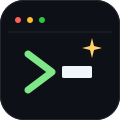
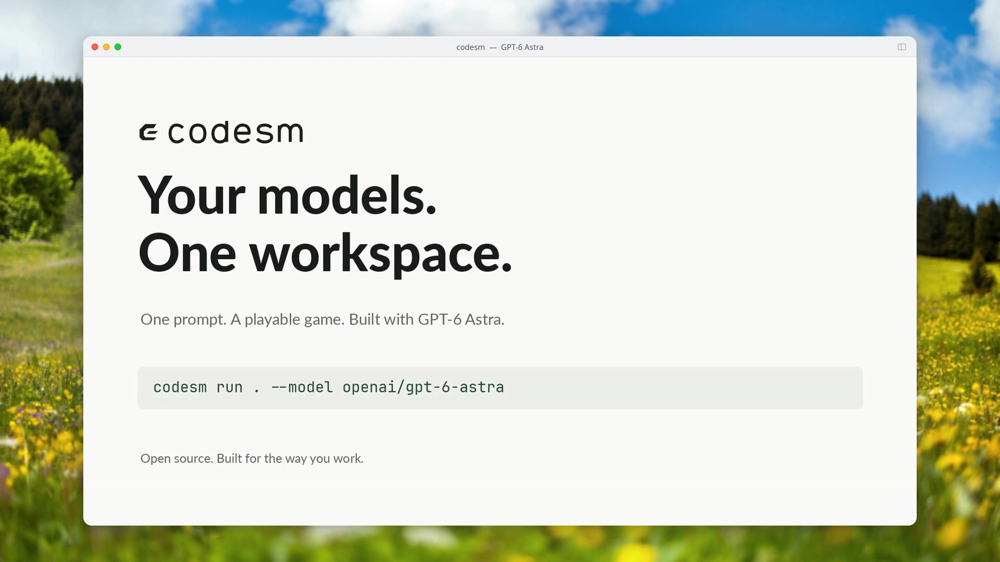
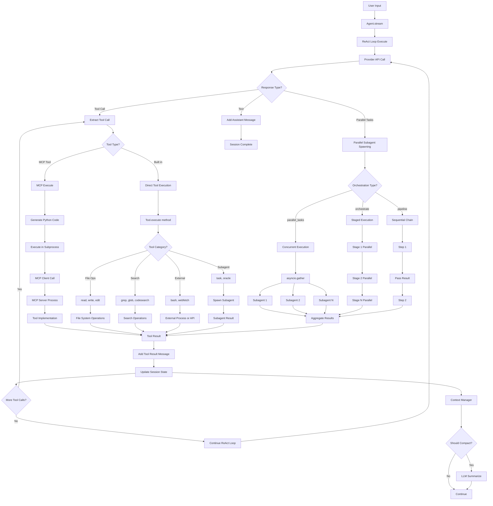

<div align="center">

<picture>
  <source media="(prefers-color-scheme: dark)" srcset="assets/logo-dark.svg" />
  
</picture>

<h1>Your models. One workspace.</h1>

<p>
  Native models, Claude Code, and Codex in one terminal.<br />
  Keep project history locally and carry context when you switch.
</p>

<p>
  <a href="#installation">Get started</a> ·
  <a href="assets/codesm-astra-demo.mp4">Watch the 57-second demo</a> ·
  <a href="#agent-backends">Agent backends</a>
</p>

<p>
  <a href="https://www.python.org/"></a>
  <a href="https://github.com/Aditya-PS-05/codesm/stargazers"></a>
  <a href="LICENSE"></a>
</p>

<h2>One prompt. A playable game.</h2>

<p>
  <a href="assets/codesm-astra-demo.mp4">
    
  </a>
</p>

<p>
  GPT-6 Astra builds a browser game with original assets, scoring, shields, and pause/resume.<br />
  A real Codesm session: build excerpts at 4× speed, followed by gameplay in real time.
</p>

<p>
  <strong><a href="assets/codesm-astra-demo.mp4">Watch the full demo — 57 seconds</a></strong> ·
  <a href="assets/codesm-astra-demo.mp4?raw=true">Download MP4</a> ·
  <a href="assets/README.md">Recording notes</a>
</p>

</div>

## Overview

**Codesm** is a terminal first AI coding agent written in Python. It supports native and OpenAI-compatible providers, exposes a wide tool surface, and runs a ReAct loop that can fan out into parallel subagents or chain them into pipelines.

Codesm combines configurable model routing, specialist agents, and an explicit
debugging workflow in one runtime. Use planner, Oracle, librarian, finder,
researcher, reviewer, and coder roles with shared project rules and task budgets.
The terminal shows which model ran, what it did, and whether the work completed,
failed, was cancelled, or remains unverified.

```bash
codesm debug "Fix the failing checkout tests" --dir ./project
codesm eval benchmarks/fix-bug-with-tests.yaml \
  --variants single,specialists,adaptive --repeat 3 --pretty
```

OpenAI Responses, Anthropic, OpenRouter, and Ollama share usage accounting.
Provider token counts and estimates are distinguished; unconfigured prices remain
unknown. Configure role models, reasoning effort, context limits, and request or
dollar budgets in `codesm.json` ([configuration](packages/docs/src/content/docs/config.mdx)).

You can also run your installed **Claude Code** and **Codex** agents inside codesm,
using their own authentication, tools, and native sessions:

```bash
# From this checkout; sign in to the official CLIs first.
uv tool install --reinstall ".[agents]"
codesm backends
codesm run ./project --backend claude-code
codesm run ./project --backend codex
```

Use **`/backend`** to switch agents in the same conversation and **`/models`** to
select the active backend's model. Codesm saves each native session ID and supplies
relevant intervening history when you switch. See the
[backend guide](packages/docs/src/content/docs/backends.mdx) for authentication,
resuming, permissions, and current limits.

The evaluation and event logs make this a testbed as well as a coding tool.
Use repeated runs to assess correctness, latency, and cost on your own tasks;
more agents do not automatically mean better results. See the
[benchmark guide](benchmarks/README.md) for fixture isolation and report semantics.

### Why "Codesm"?

The name is **code** plus the same "ism" suffix you see in *aphorism*, *mechanism*, *organism*. It implies a system, a set of habits, a way of doing a thing. Codesm is the code writing system I built to figure out *my own* habits around working with coding models, and where those habits diverge from what the models actually do.

(It also reads nicely as "code ism": a philosophy, not a tool. That is on purpose.)

## Contents

- [Overview](#overview)
  - [Why "Codesm"?](#why-codesm)
- [Features](#features)
- [Failure Modes Observed](#failure-modes-observed)
- [Installation](#installation)
  - [Quick Start](#quick-start)
  - [Prerequisites](#prerequisites)
  - [From Source](#from-source)
- [Usage](#usage)
  - [Basic Commands](#basic-commands)
  - [Providers](#providers)
  - [Agent Backends](#agent-backends)
  - [Tool System](#tool-system)
  - [Parallel Subagents](#parallel-subagents)
  - [Pipeline Subagents](#pipeline-subagents)
  - [Context Management](#context-management)
  - [Permissions and Audit](#permissions-and-audit)
  - [Sessions](#sessions)
  - [Memory and Indexing](#memory-and-indexing)
  - [Evaluation](#evaluation)
- [Configuration](#configuration)
  - [Environment Variables](#environment-variables)
- [MCP Integration](#mcp-integration)
- [How It Works](#how-it-works)
- [Architecture](#architecture)
- [Development](#development)
  - [Prerequisites](#prerequisites-1)
  - [How to Run](#how-to-run)
- [Supported Platforms](#supported-platforms)
- [CLI Reference](#cli-reference)
- [Contributing](#contributing)
- [Acknowledgments](#acknowledgments)
- [License](#license)

## Features

- **Many providers.** Native OpenAI Responses and Anthropic Messages, compatible APIs for Kimi, GLM, Gemini, DeepSeek, xAI, and Mistral, plus OpenRouter and local Ollama. Discover current models with `codesm models --refresh`, use exact model IDs, and route specialists with per-role profiles.
- **Three execution backends.** Run codesm's own agent loop, or hand the same conversation to your installed **Claude Code** (via the official Agent SDK) or **Codex** (via app-server), each using its own login, tools, and native session. Switch mid-conversation with `/backend`. See [Agent Backends](#agent-backends).
- **ReAct loop.** Canonical reason then act agent loop with streaming, automatic iteration limits, and per iteration context budget checks. Implemented in [`codesm/agent/loop.py`](./codesm/agent/loop.py).
- **Forty one built in tools.** `bash`, `read`, `write`, `edit`, `multiedit`, `patch`, `grep`, `glob`, `ls`, `codesearch` (embedding based), `lsp` (symbols, diagnostics, references), `git`, `websearch`, `webfetch`, `oracle` (deep reasoning), `refactor`, `testgen`, `bug_localize`, `code_review`, `debug`, `mermaid`, and more. All registered through a central [`tool/registry.py`](./codesm/tool/registry.py).
- **MCP server integration.** Speaks Model Context Protocol natively. Load external tools from any MCP server (`mcp-servers.json`), or expose Codesm's own tools over MCP to other agents. Full client, codegen, and sandbox implementation in [`codesm/mcp/`](./codesm/mcp/).
- **Parallel subagents.** `parallel_tasks` tool runs up to ten subagents concurrently via `asyncio.gather`, with auto routing, fail fast, and per task timing. Built for embarrassingly parallel work (find all API endpoints AND analyze auth flow AND locate tests).
- **Pipeline subagents.** `pipeline` tool chains subagents sequentially, passing each step's output to the next. Up to five stages. Built for compositional tasks where later stages depend on earlier ones.
- **Staged orchestration.** `orchestrate` tool: sequential stages, parallel tasks within each stage. The natural shape for "research then plan then implement then test" workflows.
- **Context compaction.** [`ContextManager`](./codesm/session/context.py) estimates tokens, triggers compaction at a configurable ratio of the max, and summarizes older messages via an LLM while preserving recent turns. Wired directly into the ReAct loop so compaction happens mid conversation, not just at session boundaries.
- **LSP backed code intelligence.** Real Language Server Protocol integration ([`codesm/lsp/`](./codesm/lsp/)) for symbol lookup, diagnostics, hover, and references. Gives the agent ground truth about types and symbols instead of making it guess from context.
- **Embedding code search.** `codesearch` tool uses sentence transformers for semantic code retrieval, not just string match. Handy when the agent has no idea what file to read next. Optional: install the `[search]` extra, which pulls PyTorch (~1.5 GB).
- **Permission system.** Structured permission requests for file writes, edits, and shell commands via [`codesm/permission/`](./codesm/permission/). Every grant and deny goes to an append only audit log.
- **Audit log.** [`codesm/audit/`](./codesm/audit/) records file operations, bash executions, permission decisions, and tool call traces. Designed so you can replay a session and reconstruct exactly what the agent did.
- **Session management.** Each run is a session: title, topics, summary, message history, event stream. Sessions persist, so you can resume a conversation or inspect a past run.
- **Textual TUI.** Full-width streaming transcript, expandable tool output and diffs, specialist activity, a fixed prompt, command palette, and slash commands. Built on [Textual](https://textual.textualize.io/).
- **Skills system.** Skill suggestions aware of file context. The agent gets different prompts depending on whether it is editing Python, Rust, TypeScript, or SQL. Implemented in [`codesm/skills/`](./codesm/skills/).
- **Multiple memory layers.** Session memory, project memory (CLAUDE.md and AGENTS.md style files), and topic indexed rolling summaries.

## Failure Modes Observed

> **Why this section exists:** Codesm is instrumented to surface failure modes that most agents hide. These are real things I hit while building and using it. Each one has the shape of a future benchmark or eval.

1. **Silent context overflow.** ReAct loops blow up context fast. Every tool call appends a `tool_use` and a `tool_result` block. By iteration twenty of a real coding task, you are often past the model's useful attention window even if you are still under its hard limit. Codesm's [`ContextManager`](./codesm/session/context.py) monitors token estimates and triggers an LLM based compaction before the loop stalls. The summarizer is provider agnostic. See [`session/summarize.py`](./codesm/session/summarize.py) for the three paths (`_summarize_with_anthropic`, `_summarize_with_openai`, `_summarize_with_openrouter`).

2. **Out of order tool call streaming.** Different providers interleave `text` and `tool_use` blocks differently when streaming. Claude emits text and tool_use in the order they were generated; OpenAI's Chat Completions stream has a different timing. A naive TUI that renders chunks as they arrive will show tool calls above the reasoning that justifies them. Fixed in commit [`f024ac2`](https://github.com/Aditya-PS-05/codesm) (`fix(tui): display text and tool calls in sequential order`) by buffering chunks until a message block is complete, then rendering in emission order.

3. **Tool name hallucination.** Models occasionally emit a `tool_use` block with a tool name that does not exist in the registry, often a near miss like `read_file` instead of `read`, or a tool from a previous conversation that no longer exists. Codesm's registry returns a recoverable error (`"Unknown tool: <name>. Available: ..."`) instead of crashing, so the model can self correct on the next turn. This turns a hard failure into a measurable self correction signal.

4. **Permission bypass via composition.** Giving an agent `bash` is effectively giving it everything. It can `rm`, `curl`, run `python -c`, or dump secrets with `cat ~/.ssh/id_rsa`. Codesm's permission system wraps `bash`, `write`, and `edit` through a [`Permission`](./codesm/permission/permission.py) gate with configurable allow lists and an audit trail. The interesting failure mode is *composition*: a model denied `rm` will sometimes try to accomplish the same thing via `bash -c "python -c \"import os; os.remove(...)\""`. Logging denials with the full command string makes these attempts visible and evaluable.

5. **Orchestration mode mismatch.** Given a multi step task, models default to sequential execution even when subtasks are independent. Asking the same model the same question with `parallel_tasks` vs a plain prompt produces dramatically different wall clock times and token usage. This is an evaluation axis in its own right: how well does the model choose between `parallel_tasks`, `pipeline`, and plain sequential tool calls? Codesm exposes all three primitives so you can measure it.

6. **Subagent result reintegration.** When a parallel subagent returns a long result, the parent agent's next turn sometimes ignores it or summarizes it incorrectly. This is a context attention failure, not a capability failure. Codesm logs each subagent's full output to the event stream so you can diff what was produced against what was used.

Each of these is a real, reproducible phenomenon, not a theoretical concern. They are the raw material for the kind of eval suites coding model teams build.

## Installation

### Quick Start

```bash
# Clone and install with uv (recommended)
git clone https://github.com/Aditya-PS-05/codesm
cd codesm
uv pip install -e .

# Launch the TUI
codesm run

# Or run directly with uv
uv run codesm run
```

That is it. Set `ANTHROPIC_API_KEY` (or `OPENAI_API_KEY`, or point at a local Ollama) and start typing.

> **PyPI release:** A proper PyPI package (`pip install codesm`) is on the roadmap. For now, install from source. It is a single `uv pip install -e .` away.

### Prerequisites

- [**Python**](https://www.python.org/downloads/) 3.12 or newer
- [**uv**](https://docs.astral.sh/uv/) (recommended) or `pip` for dependency management
- **At least one LLM provider** configured:
  - **Anthropic** (default): `ANTHROPIC_API_KEY`, [docs](https://docs.anthropic.com/en/api/getting-started)
  - **OpenAI**: `OPENAI_API_KEY`, [docs](https://platform.openai.com/docs/quickstart)
  - **OpenRouter**: `OPENROUTER_API_KEY`, [docs](https://openrouter.ai/docs)
  - **Ollama** (local): install [Ollama](https://ollama.com/), pull a model (`ollama pull llama3.1`), then point Codesm at it
- **Optional LSP servers** for richer code intelligence: `pylsp` or `pyright` (Python), `rust-analyzer` (Rust), `typescript-language-server` (TS and JS)
- **Optional CLIs** for the external backends: [Claude Code](https://code.claude.com/) (`claude auth login`), [Codex](https://learn.chatgpt.com/docs/auth) (`codex login`), and [Claude Science](https://claude.com/docs/claude-science/overview) (experimental; start and sign in to its local app)

Optional extras, installed on demand:

| Extra | Enables | Cost |
|-------|---------|------|
| `agents` | The `claude-code` backend (official Claude Agent SDK) | Small |
| `search` | `codesearch`, the embedding based semantic search | Pulls PyTorch, ~1.5 GB |
| `server` | `codesm serve`, the HTTP API (FastAPI and Uvicorn) | Small |
| `pdf` | PDF extraction for the `look_at` tool | Small |
| `dev` | pytest and pytest-asyncio | Small |

```bash
uv pip install -e ".[agents,dev]"    # Typical contributor setup
```

### From Source

```bash
# Clone and install in editable mode
git clone https://github.com/Aditya-PS-05/codesm
cd codesm
uv venv
source .venv/bin/activate
uv pip install -e ".[dev]"

# Run tests
pytest tests/ -v

# Launch
codesm run
```

## Usage

### Basic Commands

```bash
# Launch the interactive TUI
codesm run

# Point at a specific provider and model
codesm run --model anthropic/claude-sonnet-5
codesm run --model openai/gpt-5.6-luna
codesm run --model ollama/llama3.1

# Resume a previous session
codesm run --session <SESSION_ID>

# Run a one shot task without the TUI (scriptable)
codesm chat "Add a docstring to the hello() function in /tmp/test.py"
```

Inside the TUI, slash commands control the session:

```
/help           Show all slash commands
/init           Create or update AGENTS.md for this project
/new            Start a new session
/fork           Fork the session to explore an alternative
/branches       List session branches
/session        Browse past sessions
/models         Switch model
/backend        Switch between codesm, Claude Code, and Codex
/mode           Choose Smart or Rush mode
/smart          Smart mode: full capability
/rush           Rush mode: fast and cheap
/dryrun         Toggle dry-run mode (preview only)
/debug          Reproduce and verify a bug
/agents         List specialist agents
/audit          Show recent agent actions
/status         Show session status
/cost           Inspect session usage and cost
/connect        Connect a provider
/theme          Choose a color palette
/editor         Open an external editor
```

The transcript fills the terminal without a sidebar. The prompt stays at the
bottom, with the current model and estimated context remaining in the footer.

| Key | Action |
|-----|--------|
| `Ctrl+T` | Expand or collapse tool output, reasoning summaries, and specialist details |
| `Esc` | Interrupt active work |
| `Enter` | Send a message, or queue it while work is running |
| `Tab` | Queue a message during active work; switch Smart/Rush mode while idle |
| `Ctrl+P` | Open the command palette |
| `Ctrl+C` | Copy selection, or interrupt, or quit |
| `Ctrl+Shift+C` | Copy the current selection |
| `Ctrl+Z` | Interrupt active work, or quit when idle |
| `Ctrl+N` | Start a new session |
| `Ctrl+L` | Clear the transcript |
| `Ctrl+A` | Connect a provider |

Use `/theme` to change colors; **Terminal** is the default palette. Use `/cost`
for usage details, including costs that remain unknown until pricing is configured.

### Providers

List built-in model examples with `codesm models`, or query current catalogs with
`codesm models --refresh`. `/models` in the TUI uses the same catalog and accepts
exact `provider/model-id` values, including newly released models. See the
[provider guide](packages/docs/src/content/docs/providers.mdx) for verified model
IDs, official sources, credentials, and custom endpoints.

```bash
# Anthropic Claude (default)
export ANTHROPIC_API_KEY="sk-ant-..."
codesm run --model anthropic/claude-sonnet-5

# OpenAI
export OPENAI_API_KEY="sk-..."
codesm run --model openai/gpt-5.6-luna

# Kimi / GLM
export MOONSHOT_API_KEY="your-key"
codesm run --model kimi/kimi-k3
export ZAI_API_KEY="your-key"
codesm run --model zai/glm-5.3

# OpenRouter (routes to any model)
export OPENROUTER_API_KEY="sk-or-..."
codesm run --model openrouter/anthropic/claude-sonnet-5

# Ollama (local, no API key needed)
ollama serve
ollama pull llama3.1
codesm run --model ollama/llama3.1
```

Configure different models for specialists in `codesm.json`:

```json
{
  "model": "anthropic/claude-sonnet-5",
  "agents": {
    "finder": {"model": "google/gemini-3.8-flash"},
    "oracle": {"model": "openai/gpt-5.6-sol"}
  }
}
```

### Agent Backends

Codesm has four execution backends. The prompt, transcript, approval dialogs, tool
output, and follow-up questions always stay in codesm; only the agent doing the work
changes.

| Backend | Executes the work | Authentication |
|---------|-------------------|----------------|
| `native` | Codesm's own ReAct loop and specialist tools | Codesm's configured API providers |
| `claude-code` | Your installed Claude Code, via the official Agent SDK | Claude Code's own login |
| `codex` | Your installed Codex, via app-server | Codex's own login |
| `claude-science` (experimental) | Your running Claude Science app, via its local API | Science's own login |

Install the official CLIs and sign in with `claude auth login` or `codex login`.
Codesm does not import their saved sign-in tokens or API keys.

```bash
# From this checkout: the Claude integration needs the optional Agent SDK.
uv tool install --reinstall ".[agents]"

codesm backends                              # Report which backends are usable
codesm run ./project --backend claude-code
codesm run ./project --backend codex
codesm run ./project --backend claude-code --model sonnet
codesm chat "Inspect the failing test" --dir ./project --backend codex

# Science: start its local app and sign in in the browser first.
claude-science serve --detached
codesm run ./project --backend claude-science
```

Use **`/backend`** to switch agents inside a running conversation, and **`/models`**
to pick the active backend's model (enter `default` to let that CLI choose).
Each codesm session stores a separate native session ID per external backend:
continuing on the same backend resumes that native session, and switching away and
back forwards the intervening messages, the original task, saved compact context,
and project memory.

Handoff context is bounded and strips opaque provider replay data. Private model
state cannot be transferred, so the destination agent is explicitly asked to verify
uncertain outcomes rather than assume them. One codesm task holds a checkout at a
time, across processes.

External token usage is recorded when the CLI reports it, but subscription charges
cannot be inferred from token counts, so codesm shows external cost as **unknown**
rather than guessing. Codesm's native dollar and token budgets and its tool
allow/deny lists are not yet mapped to external runtimes; external runs reject those
configurations instead of silently ignoring them.

The Science adapter was tested with CLI **0.1.27** and uses an undocumented local
API. It reuses Science sessions after completed turns, routes questions and tool
approvals into codesm, and saves the main transcript. Text appears as Science saves
each message. Interrupted or failed Science turns start a fresh frame in the same
Science project with codesm's saved history; the original Science frame remains
available. Research figures from saved cells and image artifacts appear inline as
Science makes them available. Click **Open original image** to see full detail.
Previews use Kitty/Sixel graphics on supported terminals, with a coarse text preview
elsewhere. Originals are stored locally with the session and survive resume and
fork; clearing or deleting a session removes its copies. Rich artifact editing,
interactive/3D viewers, and plan review stay in Science's browser. Science uses
its own sandbox and filesystem grants; codesm does not automatically mount the
checkout. `read_only` is unsupported for this backend and is rejected before launch.

See the [backend guide](packages/docs/src/content/docs/backends.mdx) for permissions,
recovery behavior, and current limits.

### Tool System

Codesm ships with 41 built in tools registered through [`codesm/tool/registry.py`](./codesm/tool/registry.py). They fall into broad categories:

| Category | Tools |
|----------|-------|
| **File ops** | `read`, `write`, `edit`, `multiedit`, `multifile_edit`, `patch` |
| **Search** | `grep`, `glob`, `ls`, `codesearch` (semantic) |
| **Shell** | `bash` (gated by permissions) |
| **Code intelligence** | `lsp` (symbols, hover, references), `diagnostics` |
| **Git** | `git` (status, diff, blame, log) |
| **Web** | `websearch`, `webfetch` |
| **Subagents** | `task`, `parallel_tasks`, `pipeline`, `orchestrate`, `oracle` (deep reasoning), `finder`, `batch` |
| **Code quality** | `refactor`, `refactor_apply`, `testgen`, `bug_localize`, `code_review` |
| **Debugging** | `debug` (reproduce, hypothesize, verify), `mark_uncertain` |
| **Docs and diagrams** | `mermaid`, `diagram`, `look_at` (images and PDFs) |
| **Context and memory** | `recall`, `handoff`, `read_thread`, `find_thread`, `todo`, `skill` |
| **Editing history** | `undo`, `redo` |

Tools from connected MCP servers are registered alongside these and appear in the
same namespace.

Each tool's description is loaded from a `.txt` file next to its `.py` implementation, so prompt tuning does not require touching code. See [`codesm/tool/bash.txt`](./codesm/tool/bash.txt) for an example.

### Parallel Subagents

The `parallel_tasks` tool runs up to ten subagents concurrently. Inspired by opencode's batch and task pattern.

```json
{
  "tasks": [
    {
      "subagent_type": "researcher",
      "prompt": "Find all API endpoints in the codebase",
      "description": "Find API endpoints"
    },
    {
      "subagent_type": "researcher",
      "prompt": "Analyze the authentication flow",
      "description": "Analyze auth flow"
    },
    {
      "subagent_type": "finder",
      "prompt": "Find all test files",
      "description": "Find test files"
    }
  ],
  "fail_fast": false
}
```

**Subagent types:**

| Type | Best For | Default Model |
|------|----------|---------------|
| `coder` | Multi file edits, feature implementation | Inherits the main model |
| `researcher` | Read only code analysis | Inherits the main model |
| `reviewer` | Bug detection, security review | Inherits the main model |
| `planner` | Implementation plans | Inherits the main model |
| `finder` | Fast code search | `finder` router alias |
| `oracle` | Deep reasoning | Pinned in [`subagent.py`](./codesm/agent/subagent.py) |
| `librarian` | Multi repo research | Pinned in [`subagent.py`](./codesm/agent/subagent.py) |
| `auto` | Router picks the best agent for the task | Varies |

Roles without an explicit model inherit the main model, so a single `model` setting
moves the whole team. Override any role in `codesm.json` under `agents`, or set
`pin_model: true` to keep every specialist on the main model. Note that `oracle` and
`librarian` currently carry hardcoded model IDs; override them in config if you want
them on your own choice of model.

**Features:**
- Up to ten concurrent tasks (configurable cap to prevent resource exhaustion)
- `fail_fast: true` cancels remaining tasks on first failure
- Per task timing and success or failure indicators
- Combined result aggregation with truncation for long outputs

### Pipeline Subagents

For sequential workflows where each step reads the previous step's output:

```json
{
  "steps": [
    {
      "subagent_type": "researcher",
      "prompt": "Find all usages of the legacy_auth() function"
    },
    {
      "subagent_type": "planner",
      "prompt": "Plan a migration from legacy_auth() to the new auth system using the findings above"
    },
    {
      "subagent_type": "coder",
      "prompt": "Execute the migration plan"
    }
  ]
}
```

Each stage gets the previous stage's result injected into its prompt. Up to five pipeline steps.

For staged workflows (sequential stages, parallel tasks *within* each stage), use `orchestrate`:

```json
{
  "stages": [
    [
      {"subagent_type": "researcher", "prompt": "Analyze current auth system"},
      {"subagent_type": "finder",     "prompt": "Find all auth related files"}
    ],
    [
      {"subagent_type": "planner",    "prompt": "Plan auth improvements"}
    ],
    [
      {"subagent_type": "coder",      "prompt": "Implement planned changes"},
      {"subagent_type": "coder",      "prompt": "Add tests for new auth code"}
    ]
  ],
  "fail_fast": true
}
```

### Context Management

The [`ContextManager`](./codesm/session/context.py) tracks estimated token usage and triggers compaction before the context window fills up. Compaction preserves a configurable "recent budget" of turns and replaces the older history with an LLM generated summary.

Configuration (defaults):

```python
max_tokens = 128000           # adjust per model
compact_trigger_ratio = 0.75  # start compacting at 75% full
recent_budget_ratio   = 0.30  # keep the last 30% of messages untouched
```

Compaction runs automatically inside the ReAct loop; there is no manual trigger.
See [`codesm/agent/loop.py`](./codesm/agent/loop.py). Compaction accounts for system
instructions and tool schemas as well as conversation history, and the resulting
summary is carried into backend handoffs.

### Permissions and Audit

Codesm's permission system ([`codesm/permission/permission.py`](./codesm/permission/permission.py)) gates every destructive operation. Each request carries:

- **Action** (`bash`, `write`, `edit`, `delete`)
- **Resource** (the file path, command string, or URL)
- **Session context** (who is asking, what for)

The default policy prompts the user interactively (via the TUI); in non interactive mode it falls back to a config driven allow or deny list.

Every grant and denial is recorded in the audit log via [`codesm/audit/`](./codesm/audit/). The log captures:

- File operations (create, update, delete, diff summary)
- Bash executions (command, exit code, duration)
- Permission decisions (granted, denied, user cancelled)
- Tool call traces (tool name, arguments, result, timing)

Inspect recent actions with **`/audit`** in the TUI. Pass
`--dangerously-skip-permissions` to `codesm run` or `codesm chat` to bypass every
check — interactive prompts, path guards, and command blocks — in a sandbox or
throwaway workspace only.

### Sessions

Every Codesm run is a session. Sessions have:

- **ID**: deterministic, resumable
- **Title**: auto generated from the first user message via [`session/title.py`](./codesm/session/title.py)
- **Topics**: indexed by [`session/topics.py`](./codesm/session/topics.py) for fast search
- **Summary**: rolling summary from the compaction pipeline
- **Events**: structured event stream (tool calls, permissions, errors)
- **Backend state**: a native session ID per external backend, so switching agents resumes rather than restarts

```bash
codesm run --session <ID>          # Resume a session in the TUI
codesm chat "Continue" --session <ID> --backend claude-code
```

Browse and switch sessions with **`/session`** in the TUI; **`/fork`** branches a
session to explore an alternative, and **`/branches`** lists those branches. Forking
or clearing a conversation creates fresh backend sessions, so a branch cannot mutate
its parent's native conversation.

### Memory and Indexing

Codesm keeps cross-session memory and an optional semantic index of the codebase:

```bash
codesm memory list                 # List stored memories
codesm memory search <QUERY>       # Search stored memories
codesm memory read <RECORD_ID>     # Print one memory record
codesm memory add <TEXT>           # Add a memory manually
codesm memory forget <ID>          # Delete a specific memory
codesm memory clear                # Clear stored memories
codesm memory reindex              # Rebuild the memory index

codesm index build                 # Build the codebase index
codesm index status                # Show index status
codesm index search <QUERY>        # Search the indexed codebase
codesm index clear                 # Clear the index
```

Codesm also loads project instructions automatically, in priority order:
`AGENTS.md`, `AGENT.md`, `CLAUDE.md`, `CONTEXT.md`, `.cursorrules`, and
`.github/copilot-instructions.md`. Run `codesm init` (or `/init`) to generate an
`AGENTS.md` for your project.

### Evaluation

`codesm eval` runs a YAML task file and prints a structured JSON report, which is
what makes this a testbed rather than just a coding tool:

```bash
codesm eval benchmarks/fix-bug-with-tests.yaml --pretty
codesm eval benchmarks/fix-bug-with-tests.yaml \
  --variants single,specialists,adaptive --repeat 3
codesm eval benchmarks/long-context.yaml --all-providers
codesm eval benchmarks/refactor-rename.yaml \
  --providers anthropic/claude-sonnet-5,openai/gpt-5.6-luna --output report.json
```

`--repeat` re-runs each model and variant from a fresh starting state, so you can
separate real differences from run-to-run variance. Fixture isolation and report
semantics are documented in the [benchmark guide](benchmarks/README.md).

`codesm debug "<description>"` runs the dedicated debugging workflow: reproduce the
failure, track hypotheses, then verify against the original failing check. Traces
from any run can be browsed with `codesm trace-viewer`.

## Configuration

Codesm reads one JSON config for the main agent and its specialists. It uses the
file named by `CODESM_CONFIG`, otherwise `codesm.json` in the selected workspace,
otherwise `~/.config/codesm/config.json`. **The first file found wins; files are not
merged.**

```json title="codesm.json"
{
  "model": "anthropic/claude-sonnet-5",
  "backend": "native",
  "backend_models": {"claude-code": "sonnet"},
  "delegation": "adaptive",
  "max_requests": 60,
  "max_task_tokens": 500000,
  "agents": {
    "main":    {"reasoning_effort": "low", "max_output_tokens": 4096},
    "planner": {"reasoning_effort": "medium", "max_iterations": 10},
    "oracle":  {"reasoning_effort": "high", "max_iterations": 12},
    "finder":  {"model": "google/gemini-3.8-flash"},
    "coder":   {"max_iterations": 25}
  }
}
```

Key settings:

| Key | Purpose |
|-----|---------|
| `model` | Main model for the Native backend, as `provider/model-id` |
| `backend` | `native`, `claude-code`, `codex`, or experimental `claude-science` |
| `backend_models` | Default model per external backend |
| `delegation` | `single` (no delegation), `specialists` (named roles), or `adaptive` (roles plus automatic routing) |
| `agents` | Per-role profiles: `model`, `prompt`, `reasoning_effort`, `max_output_tokens`, `max_iterations`, `context_tokens`, `tools` |
| `routing_models` | Maps `trivial`/`simple`/`moderate`/`complex`/`expert` to `provider/model` |
| `pin_model` | Keep specialists on the main model |
| `max_requests` | Request budget for the task (default 200) |
| `max_task_tokens`, `budget_usd` | Optional token and dollar ceilings |
| `model_prices` | USD per million tokens; required before `budget_usd` can be enforced |
| `read_only`, `denied_tools` | Restrict the capability set for the whole task |

`--model` overrides the main model. A specialist uses its role's explicit `model`,
then the adaptive router's choice, then the main model. Budgets cover the main
agent, specialist calls, model-powered tools, and compaction summaries; usage is
saved with the session and restored on resume. Unpriced usage is displayed as
**unknown**, never as free.

The full reference, including role tool allowlists and routing semantics, is in the
[config guide](packages/docs/src/content/docs/config.mdx).

### Environment Variables

| Variable | Purpose |
|----------|---------|
| `ANTHROPIC_API_KEY` | Required for the Anthropic provider |
| `OPENAI_API_KEY` | Required for the OpenAI provider |
| `MOONSHOT_API_KEY` | Kimi credentials (`KIMI_API_KEY` also accepted) |
| `ZAI_API_KEY` | GLM credentials (`GLM_API_KEY` also accepted) |
| `GEMINI_API_KEY` | Google Gemini credentials (`GOOGLE_API_KEY` also accepted) |
| `DEEPSEEK_API_KEY` | DeepSeek credentials |
| `XAI_API_KEY` | xAI Grok credentials |
| `MISTRAL_API_KEY` | Mistral credentials |
| `OPENROUTER_API_KEY` | Required for OpenRouter routed models |
| `OLLAMA_HOST` | Ollama server URL (default `http://localhost:11434`) |
| `CODESM_CONFIG` | Path to the config file (default `~/.config/codesm/config.json`) |
| `CODESM_DATA_DIR` | Override data directory (default `~/.local/share/codesm/`) |
| `CODESM_LOG_LEVEL` | `error`, `warn`, `info`, `debug` |

External backends use their own authentication and configuration; codesm does not
pass API keys to them. Science's temporary local login cookies stay in memory.

## MCP Integration

Codesm speaks [Model Context Protocol](https://modelcontextprotocol.io/) and loads
tools from any configured MCP server.

### Loading external MCP tools

Codesm looks for an MCP config in this order, first match wins:

```
./.codesm/mcp.json              Project (preferred)
./mcp-servers.json              Project (alternative)
~/.config/codesm/mcp.json       User
~/.codesm/mcp.json              User (alternative)
```

```json
{
  "mcpServers": {
    "filesystem": {
      "command": "npx",
      "args": ["-y", "@modelcontextprotocol/server-filesystem", "/home/aditya"]
    },
    "github": {
      "command": "npx",
      "args": ["-y", "@modelcontextprotocol/server-github"],
      "env": {
        "GITHUB_PERSONAL_ACCESS_TOKEN": "${GITHUB_TOKEN}"
      }
    }
  }
}
```

On startup, Codesm connects to each server, fetches the tool list, and registers them through [`codesm/mcp/manager.py`](./codesm/mcp/manager.py). They appear alongside the built in tools in the registry.

Manage servers from the CLI:

```bash
codesm mcp init            # Write an example mcp-servers.json
codesm mcp list            # List configured servers and their tools
codesm mcp test            # Connect to each server and report status
```

`stdio`, `sse`, and `streamable-http` transports are supported. MCP tool calls are
generated and executed through a sandbox ([`codesm/mcp/sandbox.py`](./codesm/mcp/sandbox.py))
rather than invoked directly.

### HTTP API

```bash
codesm serve --port 4096          # HTTP API server (needs the [server] extra)
codesm trace-viewer --port 8765   # Browse session event logs and failure counts
```

## How It Works

```
┌──────────────┐     ┌──────────────────┐     ┌──────────────────┐
│     You      │────>│     Codesm       │────>│   LLM Provider   │
│  (TUI input  │     │   ReAct loop     │     │  Anthropic       │
│   + slash    │     │   Tool registry  │     │  OpenAI          │
│   commands)  │     │   Context mgr    │     │  OpenRouter      │
│              │<────│   Permissions    │<────│  Ollama          │
└──────────────┘     │   Audit log      │     └──────────────────┘
                     └────────┬─────────┘
                              │
                ┌─────────────┼─────────────┐
                │             │             │
                ▼             ▼             ▼
        ┌───────────┐  ┌───────────┐  ┌───────────┐
        │  Built in │  │    MCP    │  │ Subagents │
        │   tools   │  │  servers  │  │ (parallel │
        │  (bash,   │  │ (external │  │  pipeline │
        │   read,   │  │   tools)  │  │  orches   │
        │  write,   │  │           │  │   trate)  │
        │   LSP...) │  │           │  │           │
        └───────────┘  └───────────┘  └───────────┘
```

This is the **native** backend's loop. With `--backend claude-code`, `--backend
codex`, or `--backend claude-science`, steps 2 through 7 happen inside that agent's own loop, and
codesm keeps the transcript, approval dialogs, and session state.

1. You type a task in the TUI (or pass it via `codesm chat`)
2. The ReAct loop sends the conversation and tool schemas to the provider
3. The provider streams back text and/or tool calls
4. The TUI renders text chunks and buffers tool calls until the block is complete
5. Each tool call is dispatched through the registry:
   - Built in tools execute inline
   - MCP tools are proxied to the external server via stdio or HTTP
   - Subagent tools (`parallel_tasks`, `pipeline`, `orchestrate`) spawn new ReAct loops with fresh tool registries
6. Before each provider call, the `ContextManager` checks token usage and compacts if needed
7. Destructive operations pass through the permission system; everything lands in the audit log
8. When the provider stops requesting tools, the session completes and the result streams to the TUI

## Architecture

The full agent execution graph, including parallel and pipeline orchestration:


```mermaid
flowchart TD
    A[User Input] --> B[Agent.stream]
    B --> C[ReAct Loop Execute]
    C --> D[Provider API Call]
    D --> E{Response Type?}

    E -->|Text| F[Add Assistant Message]
    E -->|Tool Call| G[Extract Tool Call]
    E -->|Parallel Tasks| PA[Parallel Subagent Spawning]

    G --> H{Tool Type?}
    H -->|Built in| J[Direct Tool Execution]
    H -->|MCP Tool| I[MCP Execute]

    I --> K[Generate Python Code]
    K --> L[Execute in Subprocess]
    L --> M[MCP Client Call]
    M --> N[MCP Server Process]
    N --> O[Tool Implementation]
    O --> P[Tool Result]

    J --> Q[Tool.execute method]
    Q --> R{Tool Category?}
    R -->|File Ops| S[read, write, edit]
    R -->|Search| T[grep, glob, codesearch]
    R -->|External| U[bash, webfetch]
    R -->|Subagent| V[task, oracle]

    S --> W[File System Operations]
    T --> X[Search Operations]
    U --> Y[External Process or API]
    V --> Z[Spawn Subagent]

    W --> P
    X --> P
    Y --> P
    Z --> AA[Subagent Result]
    AA --> P

    PA --> PB{Orchestration Type?}
    PB -->|parallel_tasks| PC[Concurrent Execution]
    PB -->|orchestrate| PD[Staged Execution]
    PB -->|pipeline| PE[Sequential Chain]

    PC --> PF[asyncio.gather]
    PD --> PG[Stage 1 Parallel] --> PH[Stage 2 Parallel] --> PI[Stage N Parallel]
    PE --> PJ[Step 1] --> PK[Pass Result] --> PL[Step 2]

    PF --> PM[Subagent 1]
    PF --> PN[Subagent 2]
    PF --> PO[Subagent N]

    PM --> PQ[Aggregate Results]
    PN --> PQ
    PO --> PQ
    PI --> PQ
    PL --> PQ
    PQ --> P

    P --> BB[Add Tool Result Message]
    BB --> CC[Update Session State]
    CC --> DD{More Tool Calls?}

    DD -->|Yes| G
    DD -->|No| EE[Continue ReAct Loop]
    EE --> D

    F --> FF[Session Complete]

    CC --> GG[Context Manager]
    GG --> HH{Should Compact?}
    HH -->|Yes| II[LLM Summarize]
    HH -->|No| JJ[Continue]
    II --> JJ
```

**Package layout:**

- **`codesm/agent/`**: ReAct loop, agent, subagent, router, orchestrator, and the Claude Code / Codex backends
- **`codesm/provider/`**: Native/compatible clients, provider routing, and model discovery
- **`codesm/tool/`**: all built in tools, registry, descriptions
- **`codesm/mcp/`**: MCP client, manager, sandbox, codegen, config
- **`codesm/session/`**: session state, context manager, summarizer, topics
- **`codesm/permission/`**: permission system and request types
- **`codesm/audit/`**: append only audit log
- **`codesm/auth/`**: provider credential storage
- **`codesm/lsp/`**: Language Server Protocol client
- **`codesm/search/`**: embedding based code search
- **`codesm/index/`**: codebase indexer, chunking, watcher, and index CLI
- **`codesm/memory/`**: project, session, and topic memory, plus cross-backend continuation
- **`codesm/skills/`**: skill suggestions aware of file context
- **`codesm/rules/`**: project rule loading (AGENTS.md and friends)
- **`codesm/review/`**: code review and refactoring analysis
- **`codesm/eval/`**: eval task runner and reporting
- **`codesm/server/`**: HTTP API server and trace viewer
- **`codesm/storage/`**: on-disk session, lock, and event storage
- **`codesm/tui/`**: Textual app, chat, modals, command palette, autocomplete
- **`codesm/config/`**: config schema and loader
- **`codesm/snapshot/`**: file snapshots for atomic edits and rollback

## Development

> **Quick setup:** See the [Quick Start](#quick-start). This section is for contributors.

### Prerequisites

```bash
python --version   # 3.12+
uv --version       # latest

# Optional: a local Ollama server for offline testing
ollama --version
```

### How to Run

```bash
# Clone and set up
git clone https://github.com/Aditya-PS-05/codesm
cd codesm
uv venv
source .venv/bin/activate
uv pip install -e ".[dev]"

# Run the TUI
codesm run

# Run a one shot task
codesm chat "Summarize the README"

# Run the test suite
pytest tests/ -v

# Lint (if ruff is installed)
ruff check codesm/
```

<details>
<summary>Advanced Development</summary>

### Project Scripts

| Command | Description |
|---------|-------------|
| `uv pip install -e ".[dev]"` | Install with dev dependencies (pytest, pytest-asyncio) |
| `uv sync --extra agents --extra dev` | Dev setup including the Claude Code backend |
| `pytest tests/ -v` | Run the test suite |
| `pytest tests/test_mcp.py` | Run just the MCP integration tests |
| `pytest tests/test_backends.py` | Run the agent backend tests |
| `python -m codesm.tui.app` | Launch the TUI directly (skip the CLI entry point) |
| `codesm chat <prompt>` | Run a one shot task without entering the TUI |
| `codesm backends` | Check which agent backends are usable |

### Repository Layout

- **`codesm/`**: the Python package
- **`tests/`**: unit and integration tests
- **`benchmarks/`**: YAML eval tasks for `codesm eval`
- **`examples/`**: runnable examples, including `mcp_demo.py` and `mcp_code_execution_demo.py`
- **`prompts/`**: system prompts for agents and subagents
- **`packages/docs/`**: the Astro/Starlight documentation site
- **`assets/`**: logo, screenshots, demo media
- **`mcp-servers.json`**: MCP server registry

### Testing

```bash
# Unit tests
pytest tests/ -v

# Single file
pytest tests/test_mcp.py -v

# Run with coverage
pytest tests/ --cov=codesm --cov-report=term-missing
```

</details>

## Supported Platforms

| Platform | Architecture | Status |
|----------|--------------|--------|
| Linux | x86_64 | Primary development target |
| Linux | aarch64 | Supported |
| macOS | aarch64 (Apple Silicon) | Supported |
| macOS | x86_64 | Supported |
| Windows | x86_64 | Experimental (Textual TUI works; some tools assume POSIX shells) |

Codesm is pure Python. No native compilation beyond what `pip` resolves for its dependencies. If you have a working Python 3.12 and can install `textual`, you can run Codesm.

## CLI Reference

```
codesm run [DIRECTORY]      Start the agent in the interactive TUI
  --model, -m <MODEL>         provider/model-id, or an external CLI model ID
  --session, -s <ID>          Resume a saved session
  --backend, -b <BACKEND>     native, claude-code, codex, or claude-science
  --dangerously-skip-permissions
                              Bypass every permission check (sandbox only)

codesm chat <MESSAGE>       Send a single message, non-interactive
  --dir, -d <PATH>            Working directory
  --model, -m / --session, -s / --backend, -b / --dangerously-skip-permissions

codesm debug <MESSAGE>      Reproduce, diagnose, and verify a bug
  --dir, -d <PATH>            Working directory
  --model, -m <MODEL>         Model override

codesm models               List model IDs
  --provider, -p <NAME>       Filter by provider
  --refresh                   Query provider catalogs for current models
  --json                      Print IDs and discovery errors as JSON
  --dir, -d <PATH>            Project configuration directory

codesm backends             Report which agent backends are usable

codesm eval <TASK.yaml>     Run an eval task and print a JSON report
  --model, -m / --dir, -d / --output, -o
  --pretty                    Human readable summary before the JSON
  --variants <LIST>           Compare single,specialists,adaptive
  --repeat <N>                Repeat each run from a fresh starting state
  --all-providers             Compare Anthropic, OpenAI, and OpenRouter
  --providers <LIST>          Comma separated model list to compare

codesm init                 Generate AGENTS.md for the project
codesm serve                Start the HTTP API server (--port, default 4096)
codesm trace-viewer         Browse session event logs (--host, --port 8765)

codesm mcp list|test|init   Manage MCP server configuration
codesm memory list|search|read|add|forget|clear|reindex
                            Manage cross-session memory
codesm index build|status|search|clear
                            Manage the semantic codebase index

codesm --help               Show full help
codesm --version, -V        Print the version
```

There are no top-level `--provider`, `--config`, or `--log-level` flags; use
`--model provider/model-id`, the `CODESM_CONFIG` environment variable, and
`CODESM_LOG_LEVEL` respectively. See [Environment Variables](#environment-variables)
for the full list.

## Contributing

Contributions are welcome. I especially want new tools, new subagent types, new failure modes documented in [Failure Modes Observed](#failure-modes-observed), and provider adapters.

**TL;DR for a first PR:**

1. Fork the repo and create a feature branch.
2. Make your change, add a test under `tests/`.
3. Run locally:
   ```bash
   pytest tests/ -v
   ruff check codesm/  # if you have ruff installed
   ```
4. Commit with a [Conventional Commits](https://www.conventionalcommits.org/) message (`feat:`, `fix:`, `docs:`, `refactor:`...).
5. Open a PR describing the *why*, not just the *what*.

If you are adding a new tool, the convention is:

- `codesm/tool/<name>.py`: the implementation (subclass `BaseTool`, implement `execute`)
- `codesm/tool/<name>.txt`: the prompt description shown to the model
- Register it in `codesm/tool/registry.py`
- Add a test under `tests/test_tools_<name>.py`

## Acknowledgments

- [Anthropic](https://www.anthropic.com/) and [OpenAI](https://openai.com/) for the model APIs Codesm is built on top of
- [Ollama](https://ollama.com/) for making local model inference painless
- [OpenRouter](https://openrouter.ai/) for unified routing across providers
- [Textual](https://textual.textualize.io/) and [Rich](https://github.com/Textualize/rich) for the TUI framework
- [Typer](https://typer.tiangolo.com/) for the CLI ergonomics
- The [Model Context Protocol](https://modelcontextprotocol.io/) team at Anthropic for the MCP specification
- The original [ReAct paper](https://arxiv.org/abs/2210.03629) (Yao et al., 2022). Still the most useful mental model for structuring agent loops.
- [Claude Code](https://www.anthropic.com/news/claude-3-5-sonnet), [Cursor](https://cursor.sh/), [Amp](https://ampcode.com/), [Aider](https://aider.chat/), and [opencode](https://github.com/opencode-ai/opencode). Reference points for what a good coding agent feels like, and for specific design patterns (batch and task orchestration, staged execution) this project borrows from.
- [TryAudex](https://github.com/Aditya-PS-05/tryaudex) for the README layout this project copied wholesale.
- Every researcher who has written about coding agent failure modes. This tool exists to make more of them visible.

## License

<p align="center">
  <strong>MIT, by <a href="https://github.com/Aditya-PS-05">Aditya Pratap Singh</a></strong>
</p>

If you find this project useful, **please consider starring it** or [follow me on GitHub](https://github.com/Aditya-PS-05) for more work on AI coding agents, agent infrastructure, and model evaluation tooling. Issues, PRs, and new failure modes all welcome.
