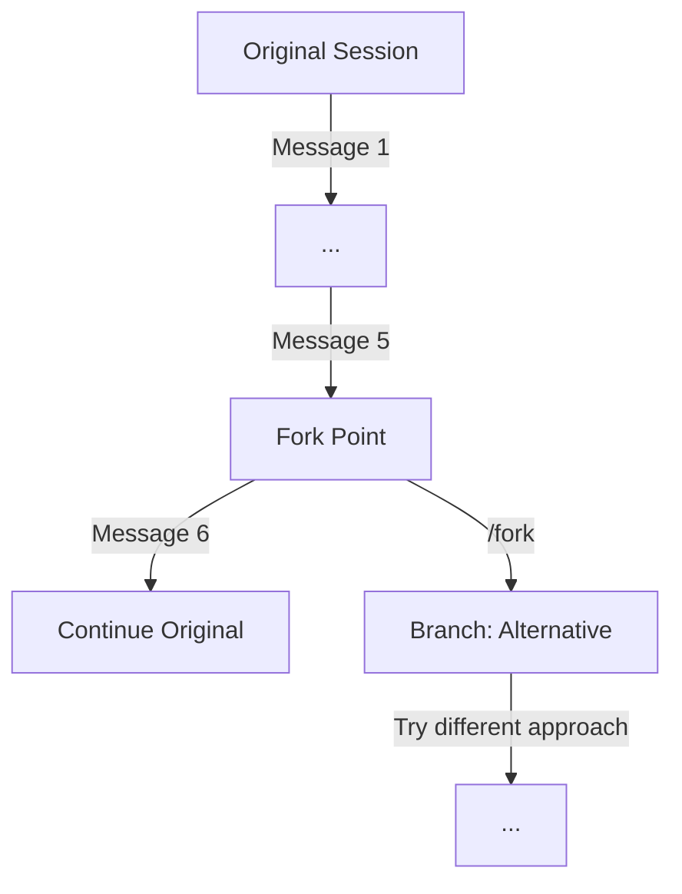

codesm supports forking conversations to explore different solutions without losing your original path.

---

## Overview

Conversation branching allows you to:
- Fork at any point to try a different approach
- Keep the original conversation intact
- Switch between branches
- Track parent-child relationships

---

## Commands

### Fork Current Session

```bash frame="none"
/fork
```

Creates a new session branched from the current point. The original session remains unchanged.

### View Branches

```bash frame="none"
/branches
```

Shows all branches of the current session.

---

## How It Works

When you fork:

1. A new session is created
2. Messages up to the fork point are copied
3. The new session tracks its parent
4. You continue in the forked session



---

## Use Cases

### Exploring Alternatives

```txt frame="none"
You: Implement authentication

Agent: [implements with JWT]

You: /fork

You: Actually, try session-based auth instead
```

Now you have two branches:
- Original: JWT implementation
- Branch: Session-based implementation

### Safe Experimentation

Before a risky change:

```txt frame="none"
/fork
```

Then proceed with the experiment. If it fails, switch back to the original.

### A/B Testing Solutions

Fork to try two different approaches, then compare results.

---

## Session List

Branches appear in the session list with their parent relationship:

```
Sessions:
├── Auth Implementation
│   ├── Auth (Branch 1) - JWT approach
│   └── Auth (Branch 2) - Session approach
└── Database Migration
```

---

## Programmatic Usage

```python
from codesm.session.session import Session

# Load a session
session = Session.load("session_id")

# Fork at current point
forked = session.fork(branch_name="Alternative approach")

# Fork at specific message
forked = session.fork(at_message=5, branch_name="Try from message 5")

# List branches
branches = session.list_branches()
for b in branches:
    print(f"{b['branch_name']}: {b['title']}")

# Check if session is a branch
if session.is_branch():
    parent = session.get_parent()
    print(f"Branched from: {parent.title}")
```

---

## Storage

Branch metadata is stored with the session:

```json
{
  "id": "session_20240115_143022_123456",
  "title": "Auth Implementation (Branch 1)",
  "parent_id": "session_20240115_140000_000000",
  "branch_point": 5,
  "branch_name": "Branch 1",
  "messages": [...]
}
```

---

## Tips

1. **Fork before risky changes** - Easy rollback
2. **Name branches descriptively** - `branch_name` helps identify purpose
3. **Compare branches** - Use `/branches` to see alternatives
4. **Clean up** - Delete branches you no longer need
